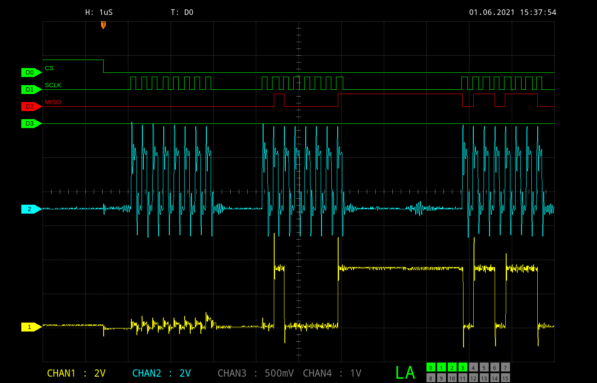

## Rigol PyQt5 screen grabber

### Description

This is another approach how to get waveforms from a Rigol DSO from the DS1000Z series.
Instead of just dumping the bitmap via SCPI, the waveform data is retreived and a nicer screenshot is generated with higher resolution.

There is the nice DSRemote Qt5 project, but the applicatin lacks the feature of grabbing and displaying the waveforms from the logic analyzer.

### Updates

    01.06.2021 : Moved from PyQtGraph to regular PyQt5 drawing
    29.05.2021 : Correct scaling and positioning of analog channels
    28.05.2021 : Querying for active LA and analog channels
                 Drawing trigger icon at correct position

### To-Do

    Add more icons and labels to reflect current settings
    Get rid of the surrouding grid lines and values
